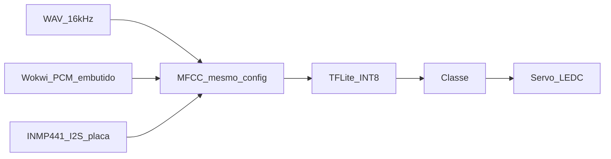

# TinyML ABRIR/FECHAR no ESP32-S3

Projeto acadêmico de comandos ABRIR/FECHAR em português no ESP32-S3: treino próprio com MFCC e TFLite INT8, servo no Wokwi com áudio injetado, e microfone I2S só na placa real.

Disciplina: IA Embarcada e Modelos Compactos. Referência: `Descrição do projeto final (1).pdf`.

## Resposta direta sobre o Edge Impulse

Conta como treinamento, conversão e compressão na letra do PDF: dataset, treino ou finetuning, compressão e deploy. Não é o caminho deste plano.

A avaliação inclui perguntas individuais sobre todas as etapas. Um SDK gerado pelo Edge Impulse deixa o grupo sem um lugar legível para explicar janela, MFCC, formato do tensor e quantização INT8. O artefato de treino fica num notebook do repositório, com parâmetros congelados e um vetor de teste que o firmware reproduz.

ESP-SR / MultiNet foi verificado na documentação da Espressif e descartado: comandos só em chinês e inglês. Português está apenas no roadmap de wake word, não em comando.

## O que a disciplina exige e o que a V1 entrega

O PDF pede quatro passos: coleta de sensor, treino com dataset público ou próprio, conversão e compressão, pipeline no dispositivo da leitura até a inferência. Hardware principal ESP32-S3, físico ou Wokwi. Entrega: slides ou código, vídeo, repositório público com git flow e commits de todos os integrantes.

A V1 cobre os quatro passos com duas entradas e um único núcleo de inferência:

- Wokwi: clip WAV embutido no firmware (não há I2S no ESP32-S3 simulado; a [tabela oficial do Wokwi](https://docs.wokwi.com/guides/esp32) marca I2S do S3 como não implementado). LEDC/servo no S3 está simulado.
- Placa real: INMP441 por I2S, mesmo modelo, mesmo servo.

Gatilho de parada da V1: um WAV conhecido produz a mesma classe no notebook e no serial do Wokwi; ABRIR vai a 90° e FECHAR a 0° no simulador; na placa, a fala faz o mesmo e silêncio/desconhecido não move o servo.

## Análise cética

Portas de uma mão:

- O contrato de áudio fica congelado antes do firmware: 16 kHz, mono, janela de 1 s, parâmetros de MFCC e layout do tensor num único `mfcc_config.json`. Mudar isso invalida o modelo já convertido.
- Alvo `esp32s3` e ESP-IDF, não Arduino. A extensão e a disciplina já fixam isso.
- Quatro classes: `silencio`, `desconhecido`, `abrir`, `fechar`. Duas classes disparam o servo em qualquer ruído.

Onde isso quebra em uso real:

- MFCC do notebook diferente do MFCC em C. O modelo funciona no PC e erra no chip.
- Overfit na voz de uma pessoa, em sala quieta. Na apresentação, com ruído, a classe vencedora oscila e o servo treme.
- Alguém liga um microfone no `diagram.json` esperando ouvir a voz. No S3 simulado o I2S não existe; a leitura vem zerada.

O que um sênior perguntaria: onde está o vetor dourado (um WAV, o MFCC e os logits gravados no treino e comparados no dispositivo); se a quantização INT8 usou dataset representativo; qual limiar e quantas janelas seguidas seguram o servo.

Limite de plataforma já verificado: I2S do ESP32-S3 no Wokwi não é simulado; LEDC PWM (servo) é. PSRAM e flash do S3 são configuráveis no `diagram.json` (`psramSize`, `flashSize`).

Aposta mais arriscada: um classificador pequeno de duas palavras em português generalizar com pouco áudio. O menor teste, antes de gravar centenas de amostras e antes de ligar o microfone, é treinar com cerca de 20 clipes e rodar um WAV conhecido no Wokwi até a classe bater com o notebook.

## Reuso

Necessidade: reconhecer ABRIR/FECHAR em português no ESP32-S3 e acionar um servo, com treino explicável na arguição.

Fontes oficiais verificadas: guia ESP32 do Wokwi; componente `espressif/esp-tflite-micro` (exemplo `micro_speech`, yes/no em inglês); documentação do ESP-SR; PDF da disciplina, que cita o Google Speech Commands como dataset público de exemplo.

- `esp-tflite-micro`: maduro, Apache-2.0, integração nativa no ESP-IDF. Usar o runtime. Não portar TensorFlow Lite na mão. O exemplo yes/no não serve como modelo final: as classes não são ABRIR/FECHAR.
- ESP-SR MultiNet: maduro, mas só chinês e inglês. Descartado para este vocabulário.
- Edge Impulse: treino e export INT8 prontos. Descartado como artefato principal pela arguição; fica como alternativa no ADR.
- Google Speech Commands: dataset público citado pelo professor, inglês. Pode alimentar a classe `desconhecido` ou ruído. As palavras-alvo têm de ser gravadas pelo grupo.
- MFCC e o runtime: o grupo implementa a extração alinhada ao config e reusa o runtime oficial. Escrever o interpretador TFLite não ensina o que a prova pergunta.

## Arquitetura da V1

Treino, no PC: clipes de 1 s, MFCC, modelo pequeno (MLP ou CNN rasa), `TFLiteConverter` com quantização INT8 e dataset representativo, mais um script que grava o vetor dourado.

Firmware: nasce do template `sample_project` em C, com alvo `esp32s3`. O componente `esp-tflite-micro` entra depois, no passo da inferência. Entrada PCM ou MFCC conforme o contrato, limiar de confiança e histerese de janelas, LEDC 50 Hz no servo (0° e 90°). GPIO do servo fora dos pinos de strap do S3 (evitar 0, 3, 45 e 46).

Wokwi: `board-esp32-s3-devkitc-1`, `wokwi-servo`, `wokwi.toml` com `firmware = build/flasher_args.json` e o ELF do app. Sem peça de microfone no diagrama da V1.

Placa: INMP441 só depois do vetor dourado passar no simulador. Mapeamento típico SCK/WS/SD em GPIOs livres, documentado no README, não copiado às cegas do tutorial.

## O que escolher no New Project Wizard

Escolher **ESP-IDF Templates → `sample_project`**. Não usar `sample_project_cpp` e não usar nenhum item de **ESP-IDF Examples** como projeto.

`sample_project` é um `main` vazio com o sistema de build certo. O firmware deste trabalho (servo, WAV embutido, modelo próprio) não existe pronto em nenhum exemplo da árvore.

O que não vira a base, e por quê:

- `sample_project_cpp`: os exemplos de periférico e o `esp-tflite-micro` são C. C++ aqui só aumenta a superfície sem ganho na arguição.
- `get-started`, `peripherals`, `wifi` e o resto da lista: são demonstrações de uma API. Copiar o projeto inteiro traz `README`, `sdkconfig` e `main` de outra coisa. O padrão de PWM se consulta em `examples/peripherals/ledc` e se reescreve no `main` do `sample_project`.
- `micro_speech` do `esp-tflite-micro`: não aparece neste wizard. Ele se cria com `idf.py create-project-from-example` e reconhece yes/no em inglês, com microfone I2S de placa ESP-EYE. A extração de features dele não é o contrato de MFCC deste plano. Serve depois como leitura de como chamar o interpretador, não como raiz do repositório.

No wizard, o alvo do chip é ESP32-S3. O primeiro `main` só sobe o serial e o servo. O modelo entra quando o notebook produzir o vetor dourado.

## Nível

Sugestão: **A (acadêmico)**. Critério: entrega de disciplina com nota individual, e o sucesso inclui outra pessoa repetir o número (seed, ambiente travado, origem dos áudios, model card). Opera como N1 no dia a dia.

Sobe de nível se vozes de pessoas de fora do grupo forem armazenadas com identidade. Aí entra registro de consentimento e privacidade; até lá o dataset é só dos integrantes, declarado no data card.

## Documentos

Dia 1, pacote acadêmico sobre N1:

- `README.md` com o fluxo, o alvo `esp32s3`, como rodar o notebook e o Wokwi, e a seed.
- `CLAUDE.md`, `docs/NIVEL.md`, `docs/ESTACIONAMENTO.md`.
- `docs/adr/0001-stack-inicial.md`: ESP-IDF + notebook próprio + `esp-tflite-micro`; Edge Impulse e ESP-SR como alternativas descartadas.
- `MODEL_CARD.md` e `DATA_CARD.md`.
- `docs/EXPERIMENTOS.md`.
- Ambiente travado (`requirements` com lock) e `.gitignore`.

Descartados por excesso no dia 1: `CHANGELOG`, `ROADMAP`, `SECURITY.md`, modelo de ameaças, runbook, pacote LGPD completo, `docs/PROMPTS.md`, CI. Git flow entra como regra do repositório público, não como documento extra.

## Fora da V1

Ficam no estacionamento: mais palavras, wake word, app ou Wi-Fi, várias pessoas fora do grupo, lógica de porta além de dois ângulos, e microfone dentro do Wokwi enquanto o I2S do S3 não existir no simulador.

## Ordem de execução

1. Scaffold acadêmico: README, ADR da stack, NIVEL, ESTACIONAMENTO, MODEL_CARD, DATA_CARD, EXPERIMENTOS, ambiente travado.
2. Criar pelo wizard o template `sample_project` (C) com alvo `esp32s3`, `wokwi.toml`, `diagram.json` (DevKitC-1 + servo) e PWM 0°/90° sem microfone. Exemplos do IDF e o `micro_speech` ficam só como referência.
3. Notebook com `mfcc_config.json` congelado, treino INT8 e script do vetor dourado.
4. Inferência do WAV embutido no Wokwi até a classe bater com o notebook e o servo mover.
5. Caminho INMP441 na placa real, reusando o mesmo modelo, com limiar para não acionar em silêncio/desconhecido.

A gravação dos áudios continua com o grupo. O código do firmware não faz parte deste arquivo.
